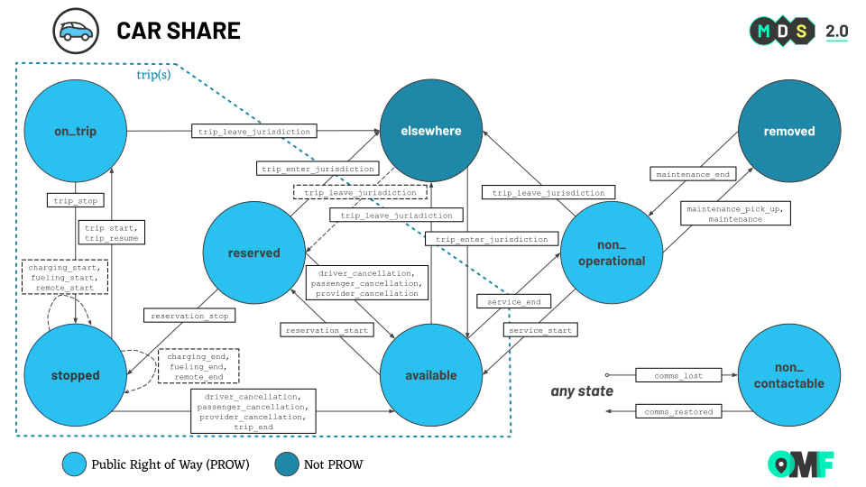

# Mobility Data Specification: **Car Share**

**Car Share** refers to shared point-to-point and station-based mutli-passenger vehicles.  Car Share typically has a driver who is the customer, and possibly one or more passengers or cargo.  

See the [modes overview](/modes) for how the mode specific information below applies across MDS.

## Table of Contents

- [Mode Attributes](#mode-attributes)
   - [Mode ID](#mode-id)
- [Trip Properties](#trip-properties)
   - [Journey ID](#journey-id)
   - [Journey Attributes](#journey-attributes)
   - [Trip ID Requirements](#trip-id-requirements)
   - [Trip Type](#trip-type)
   - [Trip Attributes](#trip-attributes)
   - [Fare Attributes](#fare-attributes)
- [Vehicle Properties](#vehicle-properties)
  - [Vehicle Attributes](#vehicle-attributes)
  - [Accessibility Attributes](#accessibility-attributes)
- [State Machine](#state-machine)
  - [Vehicle States](#vehicle-states)
  - [Event Types](#event-types)
  - [Vehicle State Events](#vehicle-states-events)
  - [State Machine Diagram](#state-machine-diagram)

## Mode Attributes

### Mode ID

The short name identifier for Car Share used across MDS is `car-share`.

[Top][toc]

## Trip Properties

_See more available trip and fare attributes for any mode used in the [trips object](/data-types.md#trips)._

### Journey ID

The `journey_id` field shall have a consistent value in overlapping trips for a single reservation period, e.g. trips taken by a customer between ignition states over the duration of their reservation. A reservation is the duration the customer has continuous exclusive access to the vehicle whether parked or in motion. Journeys may be point-to-point or multi-segment.

- **Example 1**: customer makes a reservation and company delivers vehicle to customer, then one trip point-to-point by customer, ending reservation at destination
- **Example 2**: customer reservation for multiple days with trips for errands, gas, entertainment, etc
- **Example 3**: one trip point-to-point with an employee moving the vehicle to a new location for maintenance

[Top][toc]

### Journey Attributes

The `journey_attributes` object **may** have the following key value pairs:

- `reservation_id` (UUID, optional): unique identifier for an entire car share reservation, tied across multiple journeys and therefore trips.

[Top][toc]

### Trip ID Requirements

Events require a valid `trip_id` in events where `event_types` contains `reservation_start`, `reservation_stop`, `trip_start`, `trip_resume`, `trip_end`,`trip_cancel`, `customer_cancellation`, `provider_cancellation`, or `driver_cancellation`. 

Additionally, `trip_id` is required if `event_types` contains a `trip_enter_jurisdiction` or `trip_leave_jurisdiction` event pertaining to a trip. 

[Top][toc]

### Trip Type

The `trip_type` field **must** have one of the following enumerated values:

- `private`: a private trip made by one paying customer with one or more guests
- `reservation`: en route to pickup a customer who has made a reservation, with no passengers in the vehicle
- `empty`: vehicle movement with no customer (outside of other `trip_type` values) that may need to be reported, e.g. for maintenance

[Top][toc]

### Trip Attributes

The `trip_attributes` object **may** have the following key value pairs:

- `reservation_type` (enumerated, required): how was the vehicle reserved, one of `phone_dispatch`, `phone`, `text`, `app`
- `app_name` (text, optional): name of the app used to reserve the vehicle which could be provider's app or 3rd party app
- `permit_license_number` (string, optional) - The permit license number of the organization that dispatched the vehicle
- `driver_id` (string, optional): Universal identifier of a specific driver, static across operators, like a driver's license number, for company employees in `reservation` or `empty` trip types, not `private` trips. Could also be used as a lookup in an agency's internal driver system.

[Top][toc]

### Fare Attributes

The `fare_attributes` object **may** have the following key value pairs:

- `payment_type` (enumerated, required): `account_number`, `cash`, `credit_card`, `mobile_app`, `no payment`, `phone`, `voucher`, `test`
- `fare_type` (enumerated, required): `meter_fare`, `upfront_pricing`, `flat_rate`. Indicator of which rate was charged.
- `tolls` (currency, optional) - Sum of any and all tolls charged for the trip, such as bridge tolls
- `base_rate` (currency, optional) - Minimum fare to be charged as soon as the trip starts.
- `exit_fee` (currency, optional) - Fee to exit location, like an airport
- `other_fees` (currency, optional) - amount of any fees charged to the customer. Includes baggage fees, cleaning fee. Excludes other fees returned.
- `tip` (currency, optional) - amount of tip paid by customer
- `extra_amount` (currency, optional) - miscellaneous extra amounts charged to customer not covered by other fields.
- `taxes` (currency, optional) - amount of taxes paid for the ride
- `surcharge` (currency, optional) - any surcharge pricing

[Top][toc]

## Vehicle Properties

_See more available vehicle attributes and accessibility options for any mode used in the [vehicles object](/data-types.md#vehicles)._

### Vehicle Attributes

The `vehicle_attributes` object **may** have the following key value pairs:

- `year` (integer, required)
- `make` (string, required)
- `model` (string, required)
- `color` (string, required)
- `vin` (string, required) - the Vehicle Identification Number of the vehicle
- `license_plate` (string, required) - the registered external license plate number of the vehicle
- `inspection_date` (date YYYY-MM-DD, optional) - the date of the last inspection of the vehicle
- `snow_shovel` (boolean, optional) - shovel for removing snow or ice from around vehicle or vehicle path
- `snow_brush` (boolean, optional) - brushes for removing snow or ice from vehicle
- `bike_rack` (boolean, optional) - car roof or trunk mounted bike rack
- `park_access` (boolean, optional) - access pass to a national/regional/municipal park system
- `toll_transponder` (boolean, optional) - toll transponder for national/regional toll system
- `phone_charger` (boolean, optional) - a place to charge your phone
- `sunshade` (boolean, optional) - sunshade available (i.e. for windshield)
- `cargo_volume_capacity` (integer, optional) - Cargo volume available in the vehicle, expressed in liters. For cars, it corresponds to the space between the boot floor, including the storage under the hatch, to the rear shelf in the trunk.
- `cargo_load_capacity` (integer, optional) - The capacity of the vehicle cargo space (excluding passengers), expressed in kilograms.
- `door_count` (integer, optional) - number of doors this vehicle type has
- `wheel_count` (integer, optional) - number of wheels this vehicle type has
- `air_conditioning` (boolean, optional) - vehicle has air conditioning
- `gear_switch` (enum, optional) - one of `automatic`, `manual`
- `convertible` (boolean, optional) - vehicle has a retractable roof
- `cruise_control` (boolean, optional) - vehicle has a cruise control system
- `navigation` (boolean, optional) - vehicle has a built-in navigation system

Note many of these attributes come from fields in [GBFS vehicle_types](https://github.com/MobilityData/gbfs/blob/v2.3/gbfs.md#vehicle_typesjson). 

[Top][toc]

### Accessibility Attributes

This `accessibility_attributes` enum represents the accessibility attributes available on a given vehicle, or the accessibility attributes utilized for a given trip. 

| `accessibility_attributes` | Description                           |
|----------------------------|---------------------------------------|
| `wheelchair_accessible`    | This vehicle is wheelchair accessible |

[Top][toc]

## State Machine

### Vehicle States

Valid car share vehicle states are 

- `removed`
- `available` 
- `non_operational` 
- `reserved` 
- `on_trip` 
- `stopped`
- `non_contactable`  
- `elsewhere` 

See [Vehicle States][vehicle-states] for descriptions.

[Top][toc]

### Event Types

Valid car share vehicle event types are 

- `charging_start`
- `charging_end`
- `comms_lost`
- `comms_restored`
- `customer_cancellation`
- `driver_cancellation`
- `fueling_start`
- `fueling_end`
- `maintenance`
- `maintenance_pick_up`
- `maintenance_end`
- `provider_cancellation`
- `remote_start`
- `remote_end`
- `reservation_stop`
- `reservation_start`
- `service_end`
- `service_start`
- `trip_end`
- `trip_enter_jurisdiction`
- `trip_leave_jurisdiction`
- `trip_resume`
- `trip_start`
- `trip_stop`

See vehicle [Event Types][vehicle-events] for descriptions.

[Top][toc]

### Vehicle States Events

This is the list of `vehicle_state` and `event_type` pairings that constitute the valid transitions of the vehicle state machine.

| **From** `vehicle_state` | **To** `vehicle_state` | `trip_state` | `event_type`             | Description                                                                                                     |
| ------------------------ | ---------------------- | ------------ | ------------------------ | --------------------------------------------------------------------------------------------------------------- |
| `available`              | `elsewhere`            | N/A          | `trip_leave_jurisdiction`     | The vehicle has left jurisdictional boundaries while available for-hire                                         |
| `available`              | `non_contactable`      | N/A          | `comms_lost`             | The vehicle has went out of comms while available for-use                                                       |
| `available`              | `non_operational`      | N/A          | `service_end`            | The vehicle has went out of service (is unavailable for-hire)                                                   |
| `available`              | `reserved`             | `reserved`   | `reservation_start`                | The vehicle was reserved by a passenger                                                                         |
| `elsewhere`              | `available`            | N/A          | `trip_enter_jurisdiction`     | The vehicle has entered jurisdictional boundaries while available for-hire                                      |
| `elsewhere`              | `non_contactable`      | N/A          | `comms_lost`             | The vehicle has went out of comms while outside of jurisdictional boundaries                                    |
| `elsewhere`              | `non_operational`      | N/A          | `trip_enter_jurisdiction`     | The vehicle has entered jurisdictional boundaries while not operating commercially                              |
| `elsewhere`              | `on_trip`              | `on_trip`    | `trip_enter_jurisdiction`     | The vehicle has entered jurisdictional boundaries while on a trip                                               |
| `elsewhere`              | `reserved`             | N/A          | `trip_enter_jurisdiction`     | The vehicle has entered jurisdictional boundaries while reserved by a customer                                  |
| `non_contactable`        | `available`            | N/A          | `comms_restored`         | The vehicle has come back into comms while available for-hire                                                   |
| `non_contactable`        | `elsewhere`            | N/A          | `comms_restored`         | The vehicle has come back into comms while outside of jurisdictional boundaries                                 |
| `non_contactable`        | `non_operational`      | N/A          | `comms_restored`         | The vehicle has come back into comms while not operating commercially                                           |
| `non_contactable`        | `on_trip`              | `on_trip`    | `comms_restored`         | The vehicle has come back into comms while on a trip                                                            |
| `non_contactable`        | `removed`              | N/A          | `comms_restored`         | The vehicle has come back into comms while removed                                                              |
| `non_contactable`        | `reserved`             | `reserved`   | `comms_restored`         | The vehicle has come back into comms while reserved by a passenger                                              |
| `non_contactable`        | `stopped`              | `stopped`    | `comms_restored`         | The vehicle has come back into comms while stopped                                                              |
| `non_operational`        | `available`            | N/A          | `service_start`          | The vehicle has went into service (is available for-hire)                                                       |
| `non_operational`        | `elsewhere`            | N/A          | `trip_leave_jurisdiction`     | The vehicle has left jurisdictional boundaries while not operating commercially                                 |
| `non_operational`        | `non_contactable`      | N/A          | `comms_lost`             | The vehicle has went out of comms while not operating commercially                                              |
| `non_operational`        | `removed`              | N/A          | `decommissioned`         | The vehicle has been removed from the Provider's fleet                                                          |
| `non_operational`        | `removed`              | N/A          | `maintenance_pick_up`    | The vehicle has entered the depot for maintenance                                                               |
| `non_operational`        | `removed`              | N/A          | `maintenance`            | The vehicle is undergoing maintenance on site                                                                   |
| `on_trip`                | `elsewhere`            | N/A          | `trip_leave_jurisdiction`     | The vehicle has left jurisdictional boundaries while on a trip                                                  |
| `on_trip`                | `non_contactable`      | N/A          | `comms_lost`             | The vehicle has gone out of comms while on a trip                                                               |
| `on_trip`                | `stopped`              | `stopped`    | `trip_stop`              | The vehicle has stopped while on a trip                                                                         |
| `removed`                | `non_contactable`      | N/A          | `comms_lost`             | The vehicle has gone out of comms while removed                                                                 |
| `removed`                | `non_operational`      | N/A          | `maintenance_end`        | The vehicle maintenance work has ended                                                                          |
| `removed`                | `non_operational`      | N/A          | `recommissioned`         | The vehicle has been re-added to the Provider's fleet after being previously `decommissioned`                   |
| `reserved`               | `available`            | N/A          | `customer_cancellation` | The customer has canceled the reservation                                                                      |
| `reserved`               | `available`            | N/A          | `provider_cancellation`  | The provider has canceled the reservation                                                                       |
| `reserved`               | `elsewhere`            | N/A          | `trip_leave_jurisdiction`     | The vehicle has left the jurisdiction while in a reservation                                                    |
| `reserved`               | `non_contactable`      | N/A          | `comms_lost`             | The vehicle went out of comms while being reserved by a passenger                                               |
| `reserved`               | `stopped`              | `stopped`    | `reservation_stop`           | The customer has activated the vehicle                                                              |
| `stopped`                | `available`            | N/A          | `customer_cancellation` | The customer has canceled the trip  |
| `stopped`                | `available`            | N/A          | `provider_cancellation`  | The provider has canceled the trip           |
| `stopped`                | `available`            | N/A          | `trip_end`               | The trip has been successfully completed                                                                        |
| `stopped`                | `non_contactable`      | N/A          | `comms_lost`             | The vehicle has went out of comms while stopped                                                                 |
| `stopped`                | `on_trip`              | `on_trip`    | `trip_resume`            | Resume a trip that was previously stopped (e.g. picking up a friend to go to the airport with)                  |
| `stopped`                | `on_trip`              | `on_trip`    | `trip_start`             | Start a trip                                                                                                    |
| `stopped`                | `stopped`              | `stopped`    | `charging_end`           | End charging the device battery                                                                                 |
| `stopped`                | `stopped`              | `stopped`    | `charging_start`         | Start charging the device battery                                                                               |
| `stopped`                | `stopped`              | `stopped`    | `fueling_end`            | End fueling the device with physical fuel                                                                       |
| `stopped`                | `stopped`              | `stopped`    | `fueling_start`          | Start fueling the device with physical fuel                                                                     |
| `stopped`                | `stopped`              | `stopped`    | `remote_end`             | Remotely stop the engine while vehicle is already stopped                                                       |
| `stopped`                | `stopped`              | `stopped`    | `remote_start`           | Remotely start the engine while vehicle is stopped, usually to charge battery or warm up                        |

[Top][toc]

### State Machine Diagram

This *State Machine Diagram* shows how `vehicle_state` and `event_type` relate to each other and how vehicles can transition between states. See [Google Slides](https://docs.google.com/presentation/d/1fHdq1efbN5GSFDLF4en-oA_BYPXQKbbIbHff6iROJKA/edit#slide=id.g2072486e468_1_300) for the source file.

[Top][toc]

---

[Modes Overview][modes]

---

[MDS Home][home]

[home]: /README.md
[modes]: /modes/README.md
[toc]: #table-of-contents
[vehicle-states]: /modes/vehicle_states.md
[vehicle-events]: /modes/event_types.md
