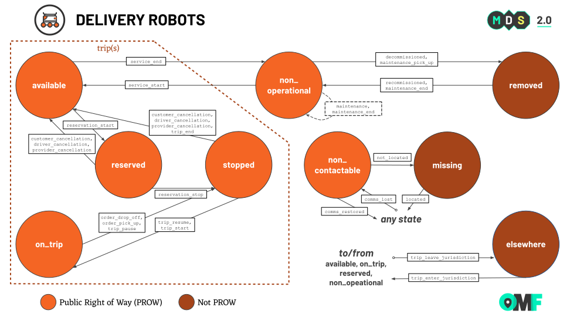

# Mobility Data Specification: **Delivery Robots**


**Delivery Robots** refers to autonomous and remotely driven goods delivery devices. There can be one or multiple orders on different trips at the same time. The state machine tracks the trip states of the orders separately from the vehicle state.  

See the [modes overview](/modes) for how the mode specific information below applies across MDS.

## Robots Vs Other Delivery Types

Autonomous and remotely piloted delivery robots do not require a driver, whereas other forms of deliveries may, e.g. in a commercial or private car, truck, bike, etc. For this MDS release, this mode is limited to deliveries where a human driver is not on board the vehicle doing the delivery, and human passengers are not being transported. 

## Table of Contents

- [Mode Attributes](#mode-attributes)
   - [Mode ID](#mode-id)
- [Trip Properties](#trip-properties)
   - [Journey ID](#journey-id)
   - [Journey Attributes](#journey-attributes)
   - [Trip ID Requirements](#trip-id-requirements)
   - [Trip Type](#trip-type)
   - [Trip Attributes](#trip-attributes)
   - [Fare Attributes](#fare-attributes)
- [Vehicle Properties](#vehicle-properties)
  - [Vehicle Attributes](#vehicle-attributes)
  - [Accessibility Attributes](#accessibility-attributes)
- [State Machine](#state-machine)
  - [Vehicle States](#vehicle-states)
  - [Event Types](#event-types)
  - [Vehicle State Events](#vehicle-states-events)
  - [State Machine Diagram](#state-machine-diagram)

## Mode Attributes

### Mode ID

The short name identifier for deliveries used across MDS is `delivery-robots`.

[Top][toc]

## Trip Properties

_See more available trip and fare attributes for any mode used in the [trips object](/data-types.md#trips)._

### Journey ID

The `journey_id` field shall have a consistent value in overlapping trips. Journeys may be point-to-point, multi-segment, or multi-segment overlapping.

- **Example 1**: delivery to a single location, then return
- **Example 2**: three overlapping delivery trips in the same journey


[Top][toc]

### Journey Attributes

The `journey_attributes` object is not used in this mode.


[Top][toc]

### Trip ID Requirements

Events require a valid `trip_id` in events where `event_types` contains `reservation_start`, `reservation_stop`, `trip_start`, `trip_pause`, `trip_resume`, `trip_end`,`trip_cancel`, `customer_cancellation`, `provider_cancellation`, or `driver_cancellation`. 

For the robots, the notion of driver does not exist, even when remotely operated.

Additionally, `trip_id` is required if `event_types` contains a `trip_enter_jurisdiction` or `trip_leave_jurisdiction` event pertaining to a trip. 

### Trip Type

The `trip_type` field is used to describe the trip itself. 

The `trip_type` field **must** have one of the following enumerated values:

- `delivery`: making a delivery
- `return`: returning to home location or next trip start
- `advertising`: displaying advertising and not making a delivery
- `mapping`: mapping the environment and not making a delivery
- `roaming`: moving in right of way but not in another trip_type

[Top][toc]

### Trip Attributes

The `trip_attributes` object **may** have the following key value pairs:

- `driver_type` (enum, required): type of driver operating the device: `human`, `semi_autonomous`, `autonomous`
- `driver_id` (UUID, [Optional](../general-information.md#optional-fields)): consistent unique identifier of the primary driver. Could be based on software version or an internal human driver id.
- `app_name` (text, [Optional](../general-information.md#optional-fields)): name of the app used to reserve the trip which could be provider's app or 3rd party app
- `requested_time` ([Timestamp][ts], [Optional](../general-information.md#optional-fields)): when the customer requested the trip
- `has_payload` (boolean, [Optional](../general-information.md#optional-fields)): is there any payload for any delivery included in the device at trip start. 1 = loaded, 0 = empty
- `range` (integer, [Optional](../general-information.md#optional-fields)): estimated range in meters based on energy levels in device at trip start
- `identification_required` (boolean, [Optional](../general-information.md#optional-fields)): does the cargo require providing customer identification before trip start or upon delivery?

[Top][toc]

### Fare Attributes

The `fare_attributes` object **may** have the following key value pairs:

- `payment_type` (enumerated, [Optional](../general-information.md#optional-fields)): `account_number`, `cash`, `credit_card`, `mobile_app`, `no payment`, `phone`, `voucher`, `test`
- `price` (currency, [Optional](../general-information.md#optional-fields)): Total price of the order

[Top][toc]

## Vehicle Properties

_See more available vehicle attributes and accessibility attributes for any mode used in the [vehicles object](/data-types.md#vehicles)._

### Vehicle Attributes

The `vehicle_attributes` object **may** have the following key value pairs:

- `year` (integer, [Optional](../general-information.md#optional-fields))
- `make` (string, [Optional](../general-information.md#optional-fields))
- `model` (string, [Optional](../general-information.md#optional-fields))
- `color` (string, [Optional](../general-information.md#optional-fields))
- `inspection_date` (date YYYY-MM-DD, [Optional](../general-information.md#optional-fields)): the date of the last inspection of the vehicle
- `equipped_cameras` (integer, [Optional](../general-information.md#optional-fields)): number of cameras equipped on device
- `equipped_lighting` (integer, [Optional](../general-information.md#optional-fields)): number of lights used to illuminate the environment on the the device
- `wheel_count` (integer, [Optional](../general-information.md#optional-fields)): number of wheels on the device
- `width` (integer, [Optional](../general-information.md#optional-fields)): width in meters of the device
- `length` (integer, [Optional](../general-information.md#optional-fields)): length in meters of the device
- `height` (integer, [Optional](../general-information.md#optional-fields)): height in meters of the device (minus flexible elements like flags)
- `weight` (integer, [Optional](../general-information.md#optional-fields)): weight in kilograms rounded up of the device not including cargo
- `top_speed` (integer, [Optional](../general-information.md#optional-fields)): theoretical top speed in meters per second of the device
- `storage_capacity` (integer, [Optional](../general-information.md#optional-fields)): cubic centimeters of cargo space available not including any cargo

[Top][toc]

### Accessibility Attributes

The `accessibility_attributes` object **may** have the following key value pairs:

- `audio_cue` (boolean, [Optional](../general-information.md#optional-fields)): is the device equipped with audio cues upon delivery
- `visual_cue` (boolean, [Optional](../general-information.md#optional-fields)): is the device equipped with visual cues upon delivery
- `remote_open` (boolean, [Optional](../general-information.md#optional-fields)): can the device door be remotely opened to retrieve cargo upon delivery

[Top][toc]

## State Machine

### Vehicle States

Valid delivery vehicle states are 

- `removed`
- `available` 
- `non_operational` 
- `reserved`
- `on_trip` 
- `stopped`
- `non_contactable`
- `missing` 
- `elsewhere`  

See [Vehicle States][vehicle-states] for descriptions.

[Top][toc]

### Event Types

Valid delivery vehicle event types are 

- `comms_lost`
- `comms_restored`
- `compliance_pick_up`
- `decommissioned`
- `not_located`
- `located`
- `maintenance`
- `maintenance_pick_up`
- `maintenance_end`
- `driver_cancellation`
- `order_drop_off`
- `order_pick_up`
- `customer_cancellation`
- `provider_cancellation`
- `recommission`
- `reservation_start`
- `reservation_stop`
- `service_end`
- `service_start`
- `trip_end`
- `trip_enter_jurisdiction`
- `trip_leave_jurisdiction`
- `trip_resume`
- `trip_start`
- `trip_pause`

See vehicle [Event Types][vehicle-events] for descriptions.

[Top][toc]

### Vehicle States Events

This is the list of `vehicle_state` and `event_type` pairings that constitute the valid transitions of the vehicle state machine.

| **From** `vehicle_state` | **To** `vehicle_state` | `trip_state` | `event_type`            | Description                                                                                   |
| ------------------------ | ---------------------- | ------------ | ----------------------- | --------------------------------------------------------------------------------------------- |
| `available`              | `elsewhere`            | N/A          | `trip_leave_jurisdiction` | The vehicle has left jurisdictional boundaries while available for-hire                       |
| `available`              | `non_contactable`      | N/A          | `comms_lost`            | The vehicle has gone out of comms while available for-use                                     |
| `available`              | `non_operational`      | N/A          | `service_end`           | The vehicle has gone out of service (is unavailable for-hire)                                 |
| `available`              | `reserved`             | `reserved`   | `reservation_start`     | The vehicle was reserved by a customer                                                        |
| `elsewhere`              | `available`            | N/A          | `trip_enter_jurisdiction` | The vehicle has entered jurisdictional boundaries while available for-hire                    |
| `elsewhere`              | `non_contactable`      | N/A          | `comms_lost`            | The vehicle has gone out of comms while outside of jurisdictional boundaries                  |
| `elsewhere`              | `non_operational`      | N/A          | `trip_enter_jurisdiction` | The vehicle has entered jurisdictional boundaries while not operating commercially            |
| `elsewhere`              | `on_trip`              | `on_trip`    | `trip_enter_jurisdiction` | The vehicle has entered jurisdictional boundaries while on a trip                             |
| `elsewhere`              | `reserved`             | N/A          | `trip_enter_jurisdiction` | The vehicle has entered jurisdictional boundaries while reserved by a customer                |
| `missing`                | `available`            | N/A          | `located`               | The vehicle has been located while available for-hire                                         |
| `missing`                | `elsewhere`            | N/A          | `located`               | The vehicle has been located while outside of jurisdictional boundaries                       |
| `missing`                | `non_operational`      | N/A          | `located`               | The vehicle has been located while not operating commercially                                 |
| `missing`                | `on_trip`              | `on_trip`    | `located`               | The vehicle has been located while on a trip                                                  |
| `missing`                | `removed`              | N/A          | `located`               | The vehicle has been located while removed                                                    |
| `missing`                | `reserved`             | `reserved`   | `located`               | The vehicle has been located while reserved by a customer                                     |
| `missing`                | `stopped`              | `stopped`    | `located`               | The vehicle has been located while stopped                                                    |
| `non_contactable`        | `available`            | N/A          | `comms_restored`        | The vehicle has come back into comms while available for-hire                                 |
| `non_contactable`        | `elsewhere`            | N/A          | `comms_restored`        | The vehicle has come back into comms while outside of jurisdictional boundaries               |
| `non_contactable`        | `missing`              | N/A          | `not_located`           | The vehicle has gone missing after a period of lost comms                                     |
| `non_contactable`        | `non_operational`      | N/A          | `comms_restored`        | The vehicle has come back into comms while not operating commercially                         |
| `non_contactable`        | `on_trip`              | `on_trip`    | `comms_restored`        | The vehicle has come back into comms while on a trip                                          |
| `non_contactable`        | `removed`              | N/A          | `comms_restored`        | The vehicle has come back into comms while removed                                            |
| `non_contactable`        | `reserved`             | `reserved`   | `comms_restored`        | The vehicle has come back into comms while reserved by a customer                             |
| `non_contactable`        | `stopped`              | `stopped`    | `comms_restored`        | The vehicle has come back into comms while stopped                                            |
| `non_operational`        | `available`            | N/A          | `service_start`         | The vehicle has gone into service (is available for-hire)                                     |
| `non_operational`        | `elsewhere`            | N/A          | `trip_leave_jurisdiction` | The vehicle has left jurisdictional boundaries while not operating commercially               |
| `non_operational`        | `non_contactable`      | N/A          | `comms_lost`            | The vehicle has gone out of comms while not operating commercially                            |
| `non_operational`        | `non_operational`      | N/A          | `maintenance`           | The vehicle has maintenance performed on site                                             |
| `non_operational`        | `non_operational`      | N/A          | `maintenance_end`       | Maintenance is complete                                             |
| `non_operational`        | `removed`              | N/A          | `maintenance_pick_up`   | The vehicle has entered the depot for maintenance                                             |
| `non_operational`        | `removed`              | N/A          | `decommissioned`        | The vehicle has been removed from the Provider's fleet                                        |
| `on_trip`                | `elsewhere`            | N/A          | `trip_leave_jurisdiction` | The vehicle has left jurisdictional boundaries while on a trip                                |
| `on_trip`                | `non_contactable`      | N/A          | `comms_lost`            | The vehicle has gone out of comms while on a trip to pick up the order                        |
| `on_trip`                | `stopped`              | N/A          | `order_drop_off`        | The vehicle is at the customer's place and is waiting for them                                |
| `on_trip`                | `stopped`              | `stopped`    | `order_pick_up`         | The vehicle has come to pick up the order at the restaurant                                   |
| `on_trip`                | `stopped`              | `stopped`    | `trip_pause`            | The vehicle has paused while on a trip                                                        |
| `removed`                | `non_contactable`      | N/A          | `comms_lost`            | The vehicle has gone out of comms while removed                                               |
| `removed`                | `non_operational`      | N/A          | `maintenance_end`       | The vehicle has left the depot                                                                |
| `removed`                | `non_operational`      | N/A          | `recommissioned`        | The vehicle has been re-added to the Provider's fleet after being previously `decommissioned` |
| `reserved`               | `available`            | N/A          | `customer_cancellation` | The customer has canceled the reservation                                                     |
| `reserved`               | `available`            | N/A          | `driver_cancellation`   | The driver has canceled the reservation                                                       |
| `reserved`               | `available`            | N/A          | `provider_cancellation` | The provider has canceled the reservation                                                     |
| `reserved`               | `elsewhere`            | N/A          | `trip_leave_jurisdiction` | The vehicle has left the jurisdiction while in a reservation                                  |
| `reserved`               | `non_contactable`      | N/A          | `comms_lost`            | The vehicle has gone of comms while being reserved by a customer                              |
| `reserved`               | `stopped`              | `stopped`    | `reservation_stop`      | The vehicle has stopped to pickup reservation                                                 |
| `stopped`                | `available`            | N/A          | `customer_cancellation` | The customer has canceled the trip while the vehicle is waiting                               |
| `stopped`                | `available`            | N/A          | `driver_cancellation`   | The driver has canceled the trip while waiting                                                |
| `stopped`                | `available`            | N/A          | `provider_cancellation` | The provider has canceled the trip while the vehicle is waiting                               |
| `stopped`                | `available`            | N/A          | `trip_end`              | The trip has been successfully completed                                                      |
| `stopped`                | `non_contactable`      | N/A          | `comms_lost`            | The vehicle has gone out of comms while stopped                                               |
| `stopped`                | `on_trip`              | `on_trip`    | `trip_resume`           | Resume a trip that was previously paused (e.g. picking up an order)                           |
| `stopped`                | `on_trip`              | `on_trip`    | `trip_start`            | Start a trip                                                                                  |

[Top][toc]

### State Machine Diagram

This *State Machine Diagram* shows how `vehicle_state` and `event_type` relate to each other and how vehicles can transition between states. See [Google Slides](https://docs.google.com/presentation/d/1fHdq1efbN5GSFDLF4en-oA_BYPXQKbbIbHff6iROJKA/edit#slide=id.g207ec9d0152_0_0) for the source file.



#### Delivery Robots State Notes

When there is only one trip ongoing, `trip_state == vehicle_state`

In cases where there are multiple trips ongoing, please follow the trip state model pseudocode for determining what the vehicle state should be:
```
t = for the one vehicle, all on-going trips which are 'delivery' or undefined trips (we do not take into account 'roaming', 'return' or 'advertising' trips)
v = vehicle state
if t.any(state == ‘stopped’):
    v = ‘stopped’ 
else:
if t.any(state == ‘on_trip’):      
    v = ‘on_trip’
else:
if t.any(state == ‘reserved’):
    v = ‘reserved’
else:
if t=[]:
    v = ‘available’

```
`trip_state` mappings should be the same as in the table above.

[Top][toc]

---

[Modes Overview][modes]

---

[MDS Home][home]

[home]: /README.md
[modes]: /modes/README.md
[toc]: #table-of-contents
[ts]: /general-information.md#timestamps
[vehicle-states]: /modes/vehicle_states.md
[vehicle-events]: /modes/event_types.md
