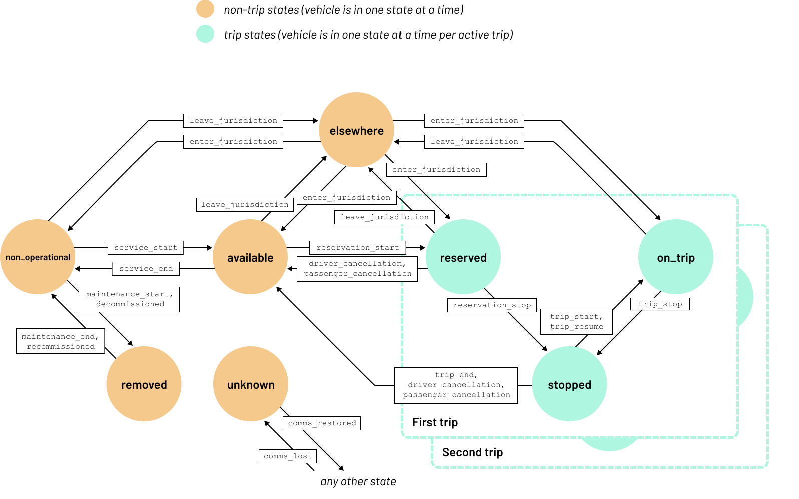

# Mobility Data Specification: **Passenger Services**


**Passenger Services** refers to taxis and transportation network companies (TNCs).  Passenger Services typically have a driver, one or more passengers, and multiple passengers may be on different trips.  The state machine tracks the trip states of the passengers separately from the vehicle state.  

See the [modes overview](/modes) for how the mode specific information below applies across MDS.

## Taxi vs. TNC implementation differences

Taxis typically require explicit tracking of maintenance while TNCs typically do not.

## Table of Contents

- [Mode Attributes](#mode-attributes)
- [Vehicle States](#vehicle-states)
- [Event Types](#event-types)
- [Vehicle State Events](#vehicle-states-events)
- [State Machine Diagram](#state-machine-diagram)

## Mode Attributes

### Mode ID

The short name identifier for Passenger Services used across MDS is `passenger-services`.

### Journey ID

The `journey_id` field shall have a consistent value in overlapping trips, e.g. "pooled" or "shared" rides with different start and/or end locations.

### Trip ID Requirements

Events require a valid `trip_id` in events where `event_types` contains `reservation_start`, `reservation_stop`, `trip_start`, `trip_stop`, `trip_end`, `passenger_cancellation`, `provider_cancellation`, or `driver_cancellation`. 

Additionally, `trip_id` is required if `event_types` contains a `enter_jurisdiction` or `leave_jurisdiction` event pertaining to a passenger trip. 

### Trip Type

The `trip_type` field is not currently used in passenger services.

### Trip Attributes

The `trip_attributes` array is not used with in passenger services.

### Vehicle Attributes

The `vehicle_attributes` array may have the following key value pairs:

- `year` (integer)
- `make` (string)
- `model` (string)

### Propulsion Types

#### Valid for vehicle_types: car

| `propulsion`      |
| ----------------- |
| `electric`        |
| `combustion`      |

### Accessibility Options

This enum represents the accessibility options available on a given vehicle, or the accessibility options utilized for a given trip. This enum is currently only used by the Passenger Services mode, and is not used by micromobility.
| `accessibility_option`  | Description                           |
|-------------------------|---------------------------------------|
| `wheelchair_accessible` | This vehicle is wheelchair accessible |
## Vehicle States

Valid passenger services vehicle states are 

- `removed`
- `available` 
- `non_operational` 
- `reserved` 
- `on_trip` 
- `stopped`
- `elsewhere` 
- `unknown`  

See [Vehicle States][vehicle-states] for descriptions.

[Top][toc]

## Event Types

Valid passenger services vehicle event types are 

- `comms_lost`
- `comms_restored`
- `driver_cancellation`
- `decommission`
- `maintenance_end`
- `maintenance_start`
- `passenger_cancellation`
- `provider_cancellation`
- `recommission`
- `reservation_cancel`
- `reservation_start`
- `service_end`
- `service_start`
- `trip_cancel`
- `trip_end`
- `trip_enter_jurisdiction`
- `trip_leave_jurisdiction`
- `trip_resume`
- `trip_start`
- `trip_stop`
- `unspecified`

This list is somewhat shorter than the micromobility event list, as passenger service vehicles are controlled by a driver or potentially an AI. They are not picked up or dropped off for rebalancing or compliance, for example, and they do not go out of service because of a low battery.

See vehicle [Event Types][vehicle-events] for descriptions.

[Top][toc]

## Vehicle States Events

This is the list of `vehicle_state` and `event_type` pairings that constitute the valid transitions of the vehicle state machine.

| **Previous** `vehicle_state` | `vehicle_state`   | `trip_state` | `event_type`             | Description                                                                                                      |
|------------------------------|-------------------|--------------|--------------------------|------------------------------------------------------------------------------------------------------------------|
| `available`                  | `elsewhere`       | N/A          | `leave_jurisdiction`     | The vehicle has left jurisdictional boundaries while available for-hire                                          |
| `available`                  | `non_operational` | N/A          | `service_end`            | The vehicle has went out of service (is unavailable for-hire)                                                    |
| `available`                  | `reserved`        | `reserved`   | `reserve`                | The vehicle was reserved by a passenger                                                                          |
| `available`                  | `unknown`         | N/A          | `comms_lost`             | The vehicle has went out of comms while available for-use                                                        |
| `elsewhere`                  | `available`       | N/A          | `enter_jurisdiction`     | The vehicle has entered jurisdictional boundaries while available for-hire                                       |
| `elsewhere`                  | `non_operational` | N/A          | `enter_jurisdiction`     | The vehicle has entered jurisdictional boundaries while not operating commercially                               |
| `elsewhere`                  | `on_trip`         | `on_trip`    | `enter_jurisdiction`     | The vehicle has entered jurisdictional boundaries while on a trip                                                |
| `elsewhere`                  | `reserved`        | N/A          | `enter_jurisdiction`     | The vehicle has entered jurisdictional boundaries while reserved by a customer                                   |
| `elsewhere`                  | `unknown`         | N/A          | `comms_lost`             | The vehicle has went out of comms while outside of jurisdictional boundaries                                     |
| `non_operational`            | `available`       | N/A          | `service_start`          | The vehicle has went into service (is available for-hire)                                                        |
| `non_operational`            | `elsewhere`       | N/A          | `leave_jurisdiction`     | The vehicle has left jurisdictional boundaries while not operating commercially                                  |
| `non_operational`            | `removed`         | N/A          | `decommissioned`         | The vehicle has been removed from the Provider's fleet                                                           |
| `non_operational`            | `removed`         | N/A          | `maintenance_start`      | The vehicle has entered the depot for maintenance                                                                |
| `non_operational`            | `unknown`         | N/A          | `comms_lost`             | The vehicle has went out of comms while not operating commercially                                               |
| `on_trip`                    | `elsewhere`       | N/A          | `leave_jurisdiction`     | The vehicle has left jurisdictional boundaries while on a trip                                                   |
| `on_trip`                    | `stopped`         | `stopped`    | `trip_stop`              | The vehicle has stopped while on a trip                                                                          |
| `on_trip`                    | `unknown`         | N/A          | `comms_lost`             | The vehicle has gone out of comms while on a trip                                                                |
| `removed`                    | `non_operational` | N/A          | `maintenance_end`        | The vehicle has left the depot                                                                                   |
| `removed`                    | `non_operational` | N/A          | `recommissioned`         | The vehicle has been re-added to the Provider's fleet after being previously `decommissioned`                    |
| `removed`                    | `unknown`         | N/A          | `comms_lost`             | The vehicle has gone out of comms while removed                                                                  |
| `reserved`                   | `available`       | N/A          | `driver_cancellation`    | The driver has canceled the reservation                                                                         |
| `reserved`                   | `available`       | N/A          | `passenger_cancellation` | The passenger has canceled the reservation                                                                      |
| `reserved`                   | `available`       | N/A          | `provider_cancellation` | The provider has canceled the reservation                                                                      |
| `reserved`                   | `elsewhere`       | N/A          | `leave_jurisdiction`     | The vehicle has left the jurisdiction while in a reservation                                                     |
| `reserved`                   | `stopped`         | `stopped`    | `reserve_stop`           | The vehicle has stopped to pick up the passenger                                                                 |
| `reserved`                   | `unknown`         | N/A          | `comms_lost`             | The vehicle went out of comms while being reserved by a passenger                                                |
| `stopped`                    | `available`       | N/A          | `driver_cancellation`    | The driver has canceled the trip while either waiting for the passenger, or dropping them off                   |
| `stopped`                    | `available`       | N/A          | `passenger_cancellation` | The passenger has canceled the trip while the vehicle is waiting to pick them up, or they are being dropped off |
| `stopped`                    | `available`       | N/A          | `provider_cancellation` | The provider has canceled the trip while the vehicle is waiting for a passenger, or dropping them off |
| `stopped`                    | `available`       | N/A          | `trip_end`               | The trip has been successfully completed                                                                         |
| `stopped`                    | `on_trip`         | `on_trip`    | `trip_resume`            | Resume a trip that was previously stopped (e.g. picking up a friend to go to the airport with)                   |
| `stopped`                    | `on_trip`         | `on_trip`    | `trip_start`             | Start a trip                                                                                                     |
| `stopped`                    | `unknown`         | N/A          | `comms_lost`             | The vehicle has went out of comms while stopped                                                                  |
| `unknown`                    | `available`       | N/A          | `comms_restored`         | The vehicle has come back into comms while available for-hire                                                    |
| `unknown`                    | `elsewhere`       | N/A          | `comms_restored`         | The vehicle has come back into comms while outside of jurisdictional boundaries                                  |
| `unknown`                    | `non_operational` | N/A          | `comms_restored`         | The vehicle has come back into comms while not operating commercially                                            |
| `unknown`                    | `on_trip`         | `on_trip`    | `comms_restored`         | The vehicle has come back into comms while on a trip                                                             |
| `unknown`                    | `removed`         | N/A          | `comms_restored`         | The vehicle has come back into comms while removed                                                               |
| `unknown`                    | `reserved`        | `reserved`   | `comms_restored`         | The vehicle has come back into comms while reserved by a passenger                                               |
| `unknown`                    | `stopped`         | `stopped`    | `comms_restored`         | The vehicle has come back into comms while stopped                                                               |

### State Machine Diagram

The *Passenger Services State Machine Diagram* shows how the `vehicle_state` and `event_type` relate to each other and how taxi vehicles can transition between states. See this [text-editable EPS](https://drive.google.com/file/d/1WusVpFK1Vm7HSJgNcA_10T74TEzuCpTB/view?usp=sharing) for the source file.



#### Passenger Services State Notes

When there is only one trip ongoing, `trip_state == vehicle_state`

In cases where there are multiple trips ongoing, please follow the trip state model pseudocode for determining what the vehicle state should be:
```
t = all on-going trips for vehicle
v = vehicle state

if t.any(state == ‘stopped’):
v = ‘stopped’ 
else:
if t.any(state == ‘on_trip’):      
v = ‘on_trip’
else:
if t.any(state == ‘reserved’):
    v = ‘reserved’
```
`trip_state` mappings should be the same as in the table above.

[Top][toc]

---

[Modes Overview][modes]

---

[MDS Home][home]

[home]: /README.md
[modes]: /modes/README.md
[toc]: #table-of-contents
[vehicle-states]: /modes/vehicle_states.md
[vehicle-events]: /modes/event_types.md
