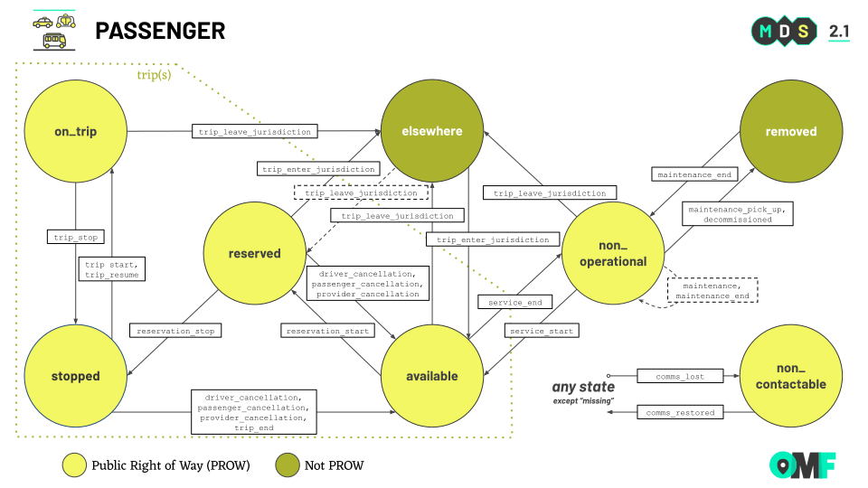

# Mobility Data Specification: **Passenger**


**Passenger** refers to employees and contractors, autonomous, and remotely operated transporting individuals or goods with a vehicle driven by another entity, including taxis, AV robotaxis, busses, transportation network companies (TNCs), commercial transport apps (CTAs), and private hire vehicles (PHVs), shuttles, paratransit, on demand vehicles, limousines, and microtransit.   

See the [modes overview](/modes) for how the mode specific information below applies across MDS.

_Note: Formerly called "Passenger Services". Any references in the specification code or links to "Passenger Services" will be updated to the shorter "Passenger" scope in the next MDS 3.0 release._

## Implementation differences

Taxis and similar traditionally regulated services typically require explicit tracking of maintenance and labor, while TNCs or other contract driver services may not. Public agency regulations, legal authority, differ based on local, state, and federal laws and jurisdictions between taxis, TNCs, CTAs, PHV, AVs, etc.

## Table of Contents

- [Mode Attributes](#mode-attributes)
   - [Mode ID](#mode-id)
- [Trip Properties](#trip-properties)
   - [Journey ID](#journey-id)
   - [Journey Attributes](#journey-attributes)
   - [Trip ID Requirements](#trip-id-requirements)
   - [Trip Type](#trip-type)
   - [Trip Attributes](#trip-attributes)
   - [Fare Attributes](#fare-attributes)
- [Vehicle Properties](#vehicle-properties)
  - [Vehicle Attributes](#vehicle-attributes)
  - [Accessibility Attributes](#accessibility-attributes)
- [State Machine](#state-machine)
  - [Vehicle States](#vehicle-states)
  - [Event Types](#event-types)
  - [Vehicle State Events](#vehicle-states-events)
  - [State Machine Diagram](#state-machine-diagram)

## Mode Attributes

### Mode ID

The short name identifier for Passenger mode used across MDS is `passenger-services`.  In a future release this will be updated to `passenger`.

[Top][toc]

## Trip Properties

_See more available trip and fare attributes for any mode used in the [trips object](/data-types.md#trips)._

### Journey ID

The `journey_id` field shall have a consistent value in overlapping trips, e.g. "pooled" or "shared" rides with different start and/or end locations. Journeys may be point-to-point, multi-segment, or multi-segment overlapping.


```mermaid
---
config:
        theme: 'base'
        themeVariables:
          'activeTaskBkgColor': '#155654'
          'activeTaskBorderColor': '#2AF1BE'
          'critBorderColor': '#2AF1BE'
          'doneTaskBkgColor': '#299c90'
          'doneTaskBorderColor': '#373737'
          'taskBkgColor': '#2AF1BE'
          'taskBorderColor': '#373737'
          'taskTextColor': '#373737'
          'taskTextDarkColor': 'white'
          'taskTextLightColor': '#373737'
          'vertLineColor': '#155654'
          'sectionBkgColor': '#ddd'
          'altSectionBkgColor': '#aaa'
          'sectionBkgColor2': '#777'
---
gantt
    title Example 1: one private trip with reservation, then return to depot
    dateFormat HH:mm
    axisFormat %H:%M

    section Journey
    Journey Start : vert, v1, 17:00, 2m

    Journey : active, a, 17:00, 55m

    Trip - reservation : b, 17:00, 10m
    Trip - private : b, 17:10, 30m
    Trip - empty : b, 17:40, 15m

    Journey End : vert, v1, 17:55, 5m
```



```mermaid
---
config:
        theme: 'base'
        themeVariables:
          'activeTaskBkgColor': '#155654'
          'activeTaskBorderColor': '#2AF1BE'
          'critBorderColor': '#2AF1BE'
          'doneTaskBkgColor': '#299c90'
          'doneTaskBorderColor': '#373737'
          'taskBkgColor': '#2AF1BE'
          'taskBorderColor': '#373737'
          'taskTextColor': '#373737'
          'taskTextDarkColor': 'white'
          'taskTextLightColor': '#373737'
          'vertLineColor': '#155654'
          'sectionBkgColor': '#ddd'
          'altSectionBkgColor': '#aaa'
          'sectionBkgColor2': '#777'
---
gantt
    title Example 2: three shared trips, some overlapping, from airport to hotels
    dateFormat HH:mm
    axisFormat %H:%M

    section Journey

    Journey - airport to hotels : active, a, 17:00, 80m
    Trip 1 - reservation : b, 17:00, 10m
    Reserve Trip 1 : vert, v1, 17:00, 2m
    Trip 1 - shared : b, 17:10, 30m
    Pickup Trip 1 : vert, v1, 17:10, 1m
    Trip 2 - reservation : b, 17:20, 10m
    Reserve Trip 2 : vert, v1, 17:20, 2m
    Trip 2 - shared : b, 17:30, 30m
    Pickup Trip 2: vert, v1, 17:30, 2m
    Dropoff Trip 1 : vert, v1, 17:40, 2m
    Trip 3 - reservation : b, 17:50, 20m
    Reserve Trip 3 : vert, v1, 17:50, 2m
    Dropoff Trip 2 : vert, v1, 18:00, 2m
    Trip 3 - private : b, 18:10, 10m
    Pickup Trip 3 : vert, v1, 18:10, 2m
    Dropoff Trip 3 : vert, v1, 18:20, 5m

```


[Top][toc]

### Journey Attributes

The `journey_attributes` object **may** have the following key value pairs:

- `shift_id` (UUID, [Optional](../general-information.md#optional-fields)): unique identifier for an entire driver's work shift, tied across multiple journeys and therefore trips.

[Top][toc]

### Trip ID Requirements

Events require a valid `trip_id` in events where `event_types` contains `reservation_start`, `reservation_stop`, `trip_start`, `trip_pause`, `trip_resume`, `trip_stop`, `trip_end`,`trip_cancel`, `customer_cancellation`, `provider_cancellation`, or `driver_cancellation`. 

Additionally, `trip_id` is required if `event_types` contains a `trip_enter_jurisdiction` or `trip_leave_jurisdiction` event pertaining to a trip. 

[Top][toc]

### Trip Type

The `trip_type` field **must** have one of the following enumerated values:

- `private` (_default_): a private trip made by one paying customer with one or more guests
- `shared`: a shared or pooled trip with more than one paying customer
- `reservation`: en route to pickup a customer who has made a reservation, with no passengers in the vehicle
- `empty`: vehicle movement with no passengers (outside of other `trip_type` values) that may need to be reported, e.g. for deadheading

[Top][toc]

### Trip Attributes

The `trip_attributes` object **may** have the following key value pairs:

- `hail_type` (enumerated, required): `street_hail`, `phone_dispatch`, `phone`, `text`, `app`
- `app_name` (text, [Optional](../general-information.md#optional-fields)): name of the app used to reserve the trip which could be provider's app or 3rd party app
- `passenger_count` (integer, required): unique count of passengers transported during trip duration
- `requested_time` ([Timestamp][ts], required): when the passenger requested the trip
- `requested_trip_start_location` ([GPS](gps), [Conditionally Required](../general-information.md#conditionally-required-fields)):  Location where the customer requested the trip to start (required if this is within jurisdictional boundaries) 
- `quoted_trip_start_time` ([Timestamp][ts], Required): Time the trip was estimated or scheduled to start, that was provided to the passenger 
- `dispatch_time` ([Timestamp][ts], [Conditionally Required](../general-information.md#conditionally-required-fields)): Time the vehicle was dispatched to the customer (required if trip was dispatched) 
- `trip_wait_time` (milliseconds, [Optional](../general-information.md#optional-fields)): part of the passenger trip where the vehicle was moving slow or stopped (e.g. <12mph), which is a different fare rate in some jurisdictions
- `trip_fare_time` (milliseconds, [Optional](../general-information.md#optional-fields)): part of the passenger trip where the vehicle was moving more quickly (e.g. >12mph), which is a different fare rate in some jurisdictions
- `pickup_address` (text, [Optional](../general-information.md#optional-fields)): street address where the trip originated from
- `dropoff_address` (text, [Optional](../general-information.md#optional-fields)): street address where the trip ended
- `permit_license_number` (string, [Optional](../general-information.md#optional-fields)) - The permit license number of the organization that dispatched the vehicle
- `driver_id` (string, [Optional](../general-information.md#optional-fields)): Universal identifier of a specific driver, static across operators, like a driver's license number. Could also be used as a lookup in an agency's internal driver system.
- `wheelchair_transported` (boolean, [Optional](../general-information.md#optional-fields)) - was a wheelchair transported as part of this trip?
- `cancellation_reason` (String, [Conditionally Required](../general-information.md#conditionally-required-fields)): The reason why a *driver* cancelled a reservation. (required if a driver cancelled a trip, and a `driver_cancellation` event_type was part of the trip) 

[Top][toc]

### Fare Attributes

The `fare_attributes` object **may** have the following key value pairs:

- `payment_type` (enumerated, required): `account_number`, `cash`, `credit_card`, `mobile_app`, `no_payment`, `paratransit`, `phone`, `voucher`, `test`
- `fare_type` (enumerated, required): `meter_fare`, `upfront_pricing`, `flat_rate`. Indicator of which rate was charged.
- `meter_fare_amount` (currency, [Conditionally Required](../general-information.md#conditionally-required-fields)): if `upfront_pricing` is used as a `fare_type` include what the metered fare would have been if `meter_fare` would have been used. Allows cost comparison in evaluation of programs and pilots.
- `tolls` (currency, [Optional](../general-information.md#optional-fields)) - Sum of any and all tolls charged for the trip, such as bridge tolls
- `base_rate` (currency, [Optional](../general-information.md#optional-fields)) - Minimum fare to be charged as soon as the trip starts.
- `exit_fee` (currency, [Optional](../general-information.md#optional-fields)) - Fee to exit location, like an airport
- `other_fees` (currency, [Optional](../general-information.md#optional-fields)) - amount of any fees charged to the customer. Includes baggage fees, cleaning fee. Excludes other fees returned.
- `tip` (currency, [Optional](../general-information.md#optional-fields)) - amount of tip paid by customer
- `extra_amount` (currency, [Optional](../general-information.md#optional-fields)) - miscellaneous extra amounts charged to customer not covered by other fields.
- `taxes` (currency, [Optional](../general-information.md#optional-fields)) - amount of taxes paid for the ride
- `surcharge` (currency, [Optional](../general-information.md#optional-fields)) - any surcharge pricing
- `commission` (currency, [Optional](../general-information.md#optional-fields)) - any extra commission for the ride
- `driver_trip_pay` (currency, [Optional](../general-information.md#optional-fields)) - The payment the driver received for the trip 
- `rate_code_id` (enumerated, [Optional](../general-information.md#optional-fields)) - one of `meter_fare`, `shared`, `out_of_town`, `disabled`, `upfront_pricing`, `promo_rate`

[Top][toc]

## Vehicle Properties

_See more available vehicle attributes and accessibility attributes for any mode used in the [vehicles object](/data-types.md#vehicles)._

### Vehicle Attributes

The `vehicle_attributes` object **may** have the following key value pairs:

- `year` (integer, [Optional](../general-information.md#optional-fields))
- `make` (string, [Optional](../general-information.md#optional-fields))
- `model` (string, [Optional](../general-information.md#optional-fields))
- `color` (string, [Optional](../general-information.md#optional-fields))
- `vin` (string, [Optional](../general-information.md#optional-fields)) - the Vehicle Identification Number of the vehicle
- `placard_number` (string, [Optional](../general-information.md#optional-fields)) - the registered placard number of the vehicle
- `license_plate` (string, [Optional](../general-information.md#optional-fields)) - the registered vehicle license/number/registration plate identifier on the vehicle
- `inspection_date` (date YYYY-MM-DD, [Optional](../general-information.md#optional-fields)) - the date of the last inspection of the vehicle

[Top][toc]

### Accessibility Attributes

This `accessibility_attributes` enum represents the accessibility attributes available on a given vehicle, or the accessibility attributes utilized for a given trip. 

| `accessibility_attributes` | Description                           |
|----------------------------|---------------------------------------|
| `wheelchair_accessible`    | This vehicle is wheelchair accessible |

[Top][toc]

## State Machine

### Vehicle States

Valid passenger vehicle states are 

- `removed`
- `available` 
- `non_operational` 
- `reserved` 
- `on_trip` 
- `stopped`
- `non_contactable` 
- `elsewhere`  

See [Vehicle States][vehicle-states] for descriptions.

[Top][toc]

### Event Types

Valid passenger vehicle event types are 

- `comms_lost`
- `comms_restored`
- `driver_cancellation`
- `maintenance`
- `maintenance_pick_up`
- `maintenance_end`
- `passenger_cancellation`
- `provider_cancellation`
- `reservation_stop`
- `reservation_start`
- `service_end`
- `service_start`
- `trip_end`
- `trip_enter_jurisdiction`
- `trip_leave_jurisdiction`
- `trip_resume`
- `trip_start`
- `trip_stop`

This list is somewhat shorter than the micromobility event list, as passenger service vehicles are controlled by a driver or potentially an AI. They are not picked up or dropped off for rebalancing or compliance, for example, and they do not go out of service because of a low battery.

See vehicle [Event Types][vehicle-events] for descriptions.

[Top][toc]

### Vehicle States Events

This is the list of `vehicle_state` and `event_type` pairings that constitute the valid transitions of the vehicle state machine.

| **From** `vehicle_state` | **To** `vehicle_state` | `trip_state` | `event_type`             | Description                                                                                                     |
| ------------------------ | ---------------------- | ------------ | ------------------------ | --------------------------------------------------------------------------------------------------------------- |
| `available`              | `elsewhere`            | N/A          | `trip_leave_jurisdiction`     | The vehicle has left jurisdictional boundaries while available for-hire                                         |
| `available`              | `non_contactable`      | N/A          | `comms_lost`             | The vehicle has went out of comms while available for-use                                                       |
| `available`              | `non_operational`      | N/A          | `service_end`            | The vehicle has went out of service (is unavailable for-hire)                                                   |
| `available`              | `reserved`             | `reserved`   | `reservation_start`                | The vehicle was reserved by a passenger                                                                         |
| `elsewhere`              | `available`            | N/A          | `trip_enter_jurisdiction`     | The vehicle has entered jurisdictional boundaries while available for-hire                                      |
| `elsewhere`              | `non_contactable`      | N/A          | `comms_lost`             | The vehicle has went out of comms while outside of jurisdictional boundaries                                    |
| `elsewhere`              | `non_operational`      | N/A          | `trip_enter_jurisdiction`     | The vehicle has entered jurisdictional boundaries while not operating commercially                              |
| `elsewhere`              | `on_trip`              | `on_trip`    | `trip_enter_jurisdiction`     | The vehicle has entered jurisdictional boundaries while on a trip                                               |
| `elsewhere`              | `reserved`             | N/A          | `trip_enter_jurisdiction`     | The vehicle has entered jurisdictional boundaries while reserved by a customer                                  |
| `non_contactable`        | `available`            | N/A          | `comms_restored`         | The vehicle has come back into comms while available for-hire                                                   |
| `non_contactable`        | `elsewhere`            | N/A          | `comms_restored`         | The vehicle has come back into comms while outside of jurisdictional boundaries                                 |
| `non_contactable`        | `non_operational`      | N/A          | `comms_restored`         | The vehicle has come back into comms while not operating commercially                                           |
| `non_contactable`        | `on_trip`              | `on_trip`    | `comms_restored`         | The vehicle has come back into comms while on a trip                                                            |
| `non_contactable`        | `removed`              | N/A          | `comms_restored`         | The vehicle has come back into comms while removed                                                              |
| `non_contactable`        | `reserved`             | `reserved`   | `comms_restored`         | The vehicle has come back into comms while reserved by a passenger                                              |
| `non_contactable`        | `stopped`              | `stopped`    | `comms_restored`         | The vehicle has come back into comms while stopped                                                              |
| `non_operational`        | `available`            | N/A          | `service_start`          | The vehicle has went into service (is available for-hire)                                                       |
| `non_operational`        | `elsewhere`            | N/A          | `trip_leave_jurisdiction`     | The vehicle has left jurisdictional boundaries while not operating commercially                                 |
| `non_operational`        | `non_contactable`      | N/A          | `comms_lost`             | The vehicle has went out of comms while not operating commercially                                              |
| `non_operational`        | `non_operational`              | N/A          | `maintenance`     | The vehicle has maintenance performed on site                                             |
| `non_operational`        | `non_operational`              | N/A          | `maintenance_end`     | Maintenance is complete                                             |
| `non_operational`        | `removed`              | N/A          | `maintenance_pick_up`      | The vehicle has entered the depot for maintenance                                                               |
| `non_operational`        | `removed`              | N/A          | `decommissioned`         | The vehicle has been removed from the Provider's fleet                                                          |
| `on_trip`                | `elsewhere`            | N/A          | `trip_leave_jurisdiction`     | The vehicle has left jurisdictional boundaries while on a trip                                                  |
| `on_trip`                | `non_contactable`      | N/A          | `comms_lost`             | The vehicle has gone out of comms while on a trip                                                               |
| `on_trip`                | `stopped`              | `stopped`    | `trip_stop`              | The vehicle has stopped while on a trip                                                                         |
| `removed`                | `non_contactable`      | N/A          | `comms_lost`             | The vehicle has gone out of comms while removed                                                                 |
| `removed`                | `non_operational`      | N/A          | `maintenance_end`        | The vehicle has left the depot                                                                                  |
| `removed`                | `non_operational`      | N/A          | `recommissioned`         | The vehicle has been re-added to the Provider's fleet after being previously `decommissioned`                   |
| `reserved`               | `available`            | N/A          | `driver_cancellation`    | The driver has canceled the reservation                                                                         |
| `reserved`               | `available`            | N/A          | `passenger_cancellation` | The passenger has canceled the reservation                                                                      |
| `reserved`               | `available`            | N/A          | `provider_cancellation`  | The provider has canceled the reservation                                                                       |
| `reserved`               | `elsewhere`            | N/A          | `trip_leave_jurisdiction`     | The vehicle has left the jurisdiction while in a reservation                                                    |
| `reserved`               | `non_contactable`      | N/A          | `comms_lost`             | The vehicle went out of comms while being reserved by a passenger                                               |
| `reserved`               | `stopped`              | `stopped`    | `reservation_stop`           | The vehicle has stopped to pick up the passenger                                                                |
| `stopped`                | `available`            | N/A          | `driver_cancellation`    | The driver has canceled the trip while either waiting for the passenger, or dropping them off                   |
| `stopped`                | `available`            | N/A          | `passenger_cancellation` | The passenger has canceled the trip while the vehicle is waiting to pick them up, or they are being dropped off |
| `stopped`                | `available`            | N/A          | `provider_cancellation`  | The provider has canceled the trip while the vehicle is waiting for a passenger, or dropping them off           |
| `stopped`                | `available`            | N/A          | `trip_end`               | The trip has been successfully completed                                                                        |
| `stopped`                | `non_contactable`      | N/A          | `comms_lost`             | The vehicle has went out of comms while stopped                                                                 |
| `stopped`                | `on_trip`              | `on_trip`    | `trip_resume`            | Resume a trip that was previously stopped (e.g. picking up a friend to go to the airport with)                  |
| `stopped`                | `on_trip`              | `on_trip`    | `trip_start`             | Start a trip                                                                                                    |

[Top][toc]

### State Machine Diagram

This *State Machine Diagram* shows how `vehicle_state` and `event_type` relate to each other and how vehicles can transition between states. See [Google Slides](https://docs.google.com/presentation/d/1fHdq1efbN5GSFDLF4en-oA_BYPXQKbbIbHff6iROJKA/edit#slide=id.g2072486e468_1_19) for the source file.



[Top][toc]

#### Passenger State Notes

When there is only one trip ongoing, `trip_state == vehicle_state`

In cases where there are multiple trips ongoing, please follow the trip state model pseudocode for determining what the vehicle state should be:
```
t = all on-going trips for vehicle
v = vehicle state

if t.any(state == ‘stopped’):
v = ‘stopped’ 
else:
if t.any(state == ‘on_trip’):      
v = ‘on_trip’
else:
if t.any(state == ‘reserved’):
    v = ‘reserved’
```
`trip_state` mappings should be the same as in the table above.

[Top][toc]

---

[Modes Overview][modes]

---

[MDS Home][home]

[gps]: /data-types.md#gps-data
[home]: /README.md
[modes]: /modes/README.md
[toc]: #table-of-contents
[ts]: /general-information.md#timestamps
[vehicle-states]: /modes/vehicle_states.md
[vehicle-events]: /modes/event_types.md
